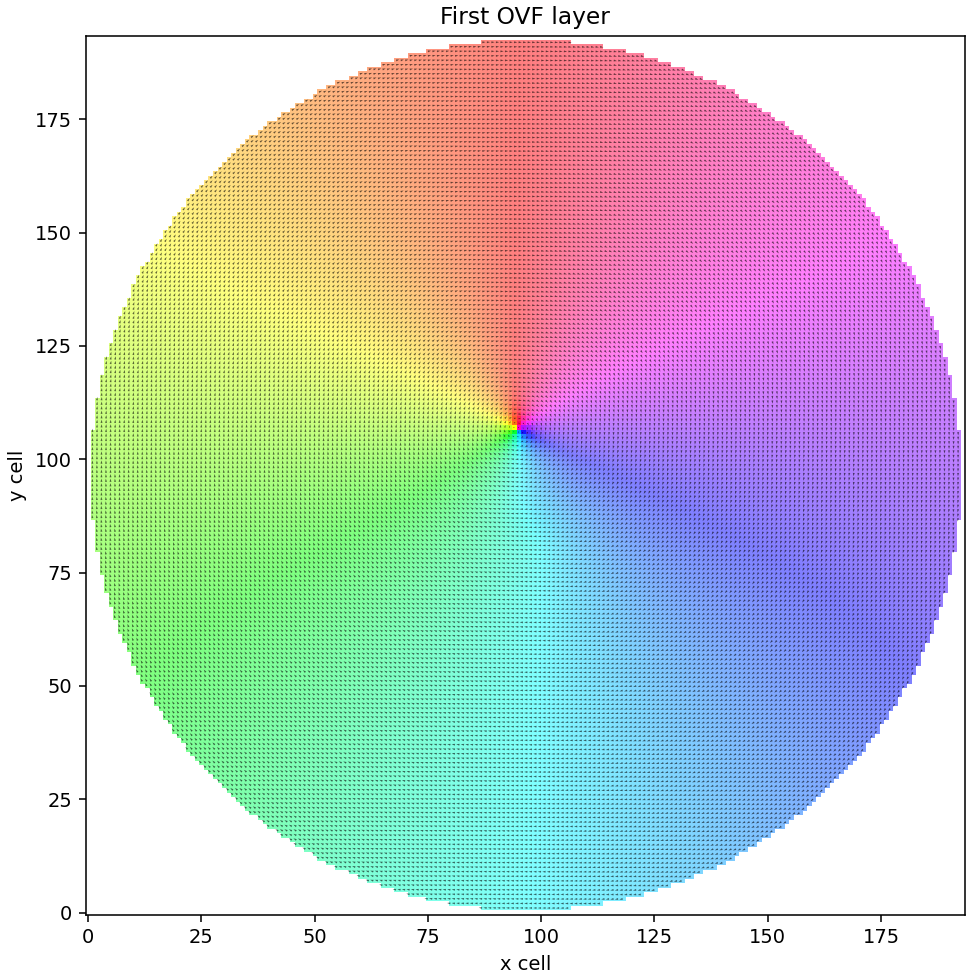

# OVFToolkit

OVFToolkit is a lightweight, high-performance C++23 and Python toolkit for
reading, writing, validating, converting, and processing OOMMF vector-field
(OVF) files. It combines modern, ownership-safe native APIs with a deliberately
simple Python interface built around real NumPy arrays.

## Highlights

- **Specification compliant:** reads and writes the documented OOMMF OVF 1.0
  and OVF 2.0 formats, including text and binary data, rectangular and
  irregular meshes, and multi-segment files.
- **Simple Python API:** context-managed readers and writers, iterable files,
  mapping-like headers, writable NumPy arrays, and native Python exceptions.
- **Bounded-memory processing:** segments load lazily and are released with
  their final Python/NumPy owner, allowing datasets much larger than RAM.
- **Fast NumPy integration:** field data is a zero-copy `numpy.ndarray`, while
  assignment safely copies into C++-owned storage without exposing
  pointers, allocators, or lifetime machinery.
- **Parallel-friendly:** independent lazy segment reads work naturally with a
  bounded `ThreadPoolExecutor` pipeline.
- **Modern C++23 interfaces:** `std::span`, `std::mdspan`, `std::expected`,
  concepts, RAII ownership, typed header access, and explicit validation
  reports.
- **Helpful metadata handling:** array shapes synchronize grid metadata,
  missing fields can be deduced, and `dummy_header` creates a valid editable
  header from a cell size.
- **Wolfram integration:** the WSTP binding exposes OVFToolkit directly to the
  Wolfram Language and installs into the user's Wolfram application directory.
- **Useful companion tools:** [FFTW/cuFFT spectral analysis](tools/batchfft/README.md),
  VTK/HDF5 conversion, and an authenticated socket controller for mumax3.
- **Small runtime surface:** the Python wheel needs only NumPy; CUDA, Boost,
  Go, Mathematica, VTK, and HDF5 remain optional build/tool dependencies.

In one representative local test, the lazy Python reader processed a 3.8 GiB,
321-segment OVF file in 5.9 seconds with a 53 MiB peak resident set. A bounded
four-thread RMS calculation completed in 3.2 seconds at 78 MiB peak. Results
depend on storage and hardware, but memory remains proportional to in-flight
segments rather than the complete file.

## Python

Binary wheels expose lazy, bounded-memory OVF segment access as writable NumPy
arrays:

```sh
python -m pip install ovftoolkit
```

```python
import ovftoolkit as ovf

with ovf.reader("input.ovf") as source:
    for field in source:
        analyse(field.data)
```

Create files by assigning a rank-4 rectangular or rank-2 irregular NumPy
array. For rectangular data, `dummy_header` fills a valid unit/header template
from the array shape and supplied cell size:

```python
field = ovf.VField()
field.data = array
field.dummy_header((dx, dy, dz))
field.header[ovf.OVFParameter.Title] = "Example"

with ovf.writer("output.ovf") as destination:
    destination.write(field)
```

## Examples

[`examples/create_ovf.py`](examples/create_ovf.py) creates a normalized
in-plane vortex with NumPy, supplies only its cell size, and writes a complete
OVF file. [`examples/plot_ovf.py`](examples/plot_ovf.py) reads the first layer
and renders every nonzero cell in the familiar mumax3 style:

```python
with ovf.reader("field.ovf") as source:
    m = source[0].data[0]                 # first z layer: [y, x, component]

mx, my, mz = np.moveaxis(m, -1, 0)
present = np.any(m != 0, axis=-1)
hue = (np.arctan2(my, mx) / (2*np.pi) + 1) % 1
saturation = np.clip((mz + 1) / 2, 0, 1)
```

Hue represents the in-plane angle, saturation represents the z component
mapped from `[-1, 1]` to `[0, 1]`, and arrows show the in-plane direction in
every populated cell. Exact `(0, 0, 0)` vectors are left transparent.



## Requirements

The core C++ library requires:

- CMake 3.30 or newer;
- a C++23 compiler and standard library;
- POSIX threads or the Windows threading runtime;
- Boost 1.58 or newer headers;
- native `std::mdspan`, or the bundled Kokkos mdspan reference implementation.

Python bindings additionally require Python 3.10 or newer, its development
headers, and nanobind installed for that same Python interpreter. NumPy is a
runtime dependency; Matplotlib is needed only for the plotting example.

Optional components are enabled when their dependencies are available:

- Boost.Program_options plus FFTW3 and/or CUDA cuFFT for `ovf-batchfft`;
- HDF5 and VTK for `ovf-convert`;
- Wolfram Mathematica with WSTP for `math-ovftoolkit`;
- Go, Git, CUDA, and Python for the GPL-licensed mumax runner;
- Doxygen, and optionally Graphviz, for API documentation.

## Building

A normal build discovers and enables available optional components:

```sh
cmake -S . -B build -DCMAKE_BUILD_TYPE=Release
cmake --build build --parallel
ctest --test-dir build --output-on-failure
cmake --install build --prefix "$HOME/.local"
```

For multi-configuration generators such as Visual Studio, omit
`CMAKE_BUILD_TYPE` and select the configuration while building and installing:

```powershell
cmake -S . -B build
cmake --build build --config Release --parallel
ctest --test-dir build -C Release --output-on-failure
cmake --install build --config Release --prefix "$env:LOCALAPPDATA\OVFToolkit"
```

To build only the core library and Python binding, without probing heavyweight
tool integrations:

```sh
python -m pip install nanobind
cmake -S . -B build-python \
  -DCMAKE_BUILD_TYPE=Release \
  -DPython_EXECUTABLE="$(command -v python)" \
  -DOVFTOOLKIT_BUILD_TOOLS=OFF \
  -DOVFTOOLKIT_BUILD_DOCS=OFF \
  -DOVFTOOLKIT_BUILD_WOLFRAM_BINDING=OFF \
  -DBUILD_TESTING=OFF
cmake --build build-python --parallel
```

CMake queries the selected interpreter with `python -m nanobind --cmake_dir`;
nanobind and Python are therefore not supplied by vcpkg. When multiple Python
installations exist, set `Python_EXECUTABLE` to the interpreter for which
nanobind was installed.

Individual optional features can be controlled with
`OVFTOOLKIT_BUILD_TOOLS`, `OVFTOOLKIT_BUILD_PYTHON_BINDING`,
`OVFTOOLKIT_BUILD_WOLFRAM_BINDING`, `OVFTOOLKIT_BUILD_MUMAX_RUNNER`,
and `OVFTOOLKIT_BUILD_DOCS`. Each accepts `AUTO` (the default), `ON`, or
`OFF`. `AUTO` builds the feature when its dependencies are usable, `ON`
requires the feature and reports missing or incompatible dependencies, and
`OFF` disables it. In particular, static Python installations are skipped in
`AUTO` mode because a nanobind extension requires a shared Python runtime.

## Python packages

Install directly from a source checkout with:

```sh
python -m pip install .
```

Build the source distribution and a wheel using the standard frontend:

```sh
python -m pip install build
python -m build
```

The included `cibuildwheel` configuration targets CPython 3.10 through 3.14 on
64-bit Linux and Windows:

```sh
python -m pip install cibuildwheel
python -m cibuildwheel --output-dir wheelhouse
```

Windows CI additionally publishes one `cp312-abi3` wheel. It uses nanobind's
CPython 3.12+ stable ABI and is tested with a newer Python before upload. Normal
source builds remain available for Python 3.10 and 3.11; stable ABI mode is an
explicit packaging option (`OVFTOOLKIT_PYTHON_STABLE_ABI=ON`).

The separately licensed mumax controller is packaged independently:

```sh
cd tools/mumax-runner
python -m build
```

Its distribution name is `ovftoolkit-mumax-runner`; it does not bundle CUDA,
mumax3, or `mumax-slave`.

The repository is organised into:

- `OVFParser/` — the public C++ library;
- `tools/` — standalone command-line applications;
- `bindings/` — integrations with external languages and runtimes;
- `tests/` — library and numerical regression tests;
- `docs/` — documentation build configuration.

## Documentation

When Doxygen is installed, configure normally and build the documentation with:

```sh
cmake --build build --target ovftoolkit-docs
```

## License

Most original OVFToolkit source is distributed under the
[MIT License](LICENSE). The exception is `tools/mumax-runner/`, which is a
separate GPL-3.0-or-later distribution because its Go executable incorporates
mumax3. Third-party source and libraries retain their own licenses.

The license requirements of a binary depend on the components linked into it:

| Artifact | Distribution terms |
| --- | --- |
| `ovfparser` and the Python `ovftoolkit` wheel | MIT, with the notices for included dependencies. |
| `ovf-convert` | OVFToolkit code remains MIT; include the VTK, HDF5, NetCDF, and transitive dependency notices from the actual build. |
| CUDA-only `ovf-batchfft` | OVFToolkit code remains MIT; NVIDIA's terms also apply to any CUDA redistributables. |
| FFTW-linked `ovf-batchfft` | When FFTW is used under its GPL terms, distribute the executable under GPL-3.0-or-later and provide its complete corresponding source. Static and dynamic linking have the same licensing consequence. |
| FFTW-and-cuFFT `ovf-batchfft` | Not published by this project. OVFToolkit has no FFTW copyright-holder CUDA exception; obtain legal review or a commercial FFTW license before distributing it. |
| `mumax-slave` and the mumax runner | GPL-3.0-or-later with mumax3's GPLv3 section 7 CUDA permission; provide the exact corresponding runner and mumax3 source. |
| `math-ovftoolkit` | OVFToolkit source remains MIT, but check the applicable Wolfram agreement before redistributing a WSTP-linked binary. |

See [LICENSING.md](LICENSING.md) for the release checklist and precise scope,
and [THIRD_PARTY_NOTICES.md](THIRD_PARTY_NOTICES.md) for the dependency
inventory. Packaged artifacts must carry the verbatim notices for the exact
direct and transitive libraries they contain; for vcpkg builds these are under
`vcpkg_installed/<triplet>/share/<port>/copyright`.
